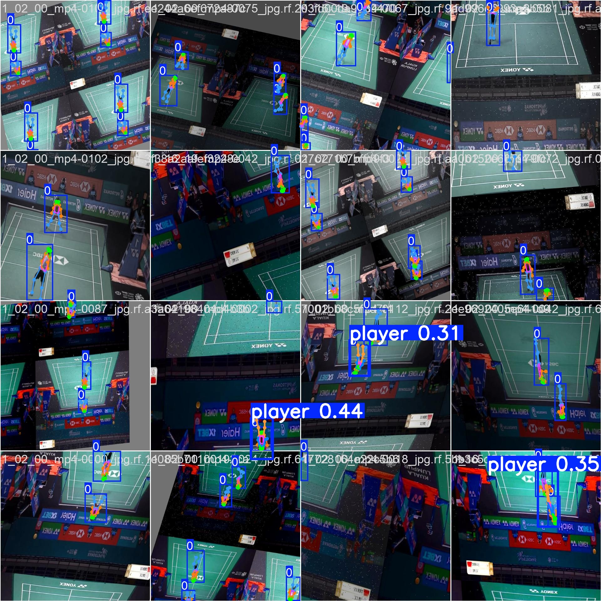

<<<<<<< HEAD
# YOLO Bedminton Pose Detection 🏸

本專案使用 **YOLOv8** 模型進行羽球選手姿勢偵測。  
可用於分析羽球運動員動作、姿勢分類與訓練輔助。

---

## 📂 專案結構
```
├── asset/                # 專案成果圖片與範例
│   ├── output_result.jpg # 偵測結果輸出
│   └── confusion_matrix.png
├── weights/
│   └── best.pt           # 訓練後的 YOLOv8 權重檔
├── main.ipynb            # 主程式 (Jupyter Notebook)
├── requirements.txt      # 所需套件清單
└── README.md
```

---

## 🚀 使用方法

### 1. 安裝套件
```bash
pip install -r requirements.txt
```

### 2. 執行程式
開啟 `main.ipynb`，依序執行所有程式碼區塊，即可產生姿勢偵測結果。  
輸出結果會儲存在 `asset/` 資料夾下。

---

## 🖼️ 成果展示
### 模型輸出結果


---

## 🧰 技術細節
- **YOLOv8**: 物件偵測模型  
- **OpenCV**: 圖像讀取與輸出  
- **PyTorch**: 深度學習框架

---

## 📜 版本
- Python 3.12
- torch >= 2.1
- YOLOv8 >= 8.2
=======
# yolo-tennispose
A YOLO-based pose detection project for tennis player movement analysis.
>>>>>>> bde3da0809ad94558c3db81fb2ffe64f864e2bf5
